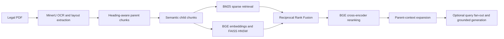

# Indian Legal Hybrid RAG

An extensible hybrid retrieval-augmented generation system for Indian legal
documents. The current corpus is the **Constitution of India (as on 1 May
2024)**, with the retrieval pipeline designed to support additional statutes,
regulations, judgments, and other legal sources in the future.

The project combines lexical and semantic retrieval, rank fusion, neural
reranking, and parent-child context expansion to retrieve legally relevant
sections without relying on a single search method.

> **Status:** Active research and development. The retrieval and evaluation
> workflows are functional but are still being modularized and calibrated.

## Why Hybrid Retrieval?

Legal queries often mix:

- Exact references such as article numbers, schedules, amendments, and legal
  terminology.
- Semantic questions whose wording differs from the source document.
- Multi-part questions that require evidence from multiple constitutional
  provisions.

Sparse retrieval is effective for exact legal terms, while dense retrieval
captures semantic similarity. This project combines both signals and then
reranks the fused candidates before expanding the selected child chunks to
their larger parent sections.

## Pipeline



### 1. Document extraction

The source PDF is processed with
[MinerU](https://github.com/opendatalab/MinerU) to preserve headings, lists,
tables, and page-level layout information. The extraction command and Colab
workflow are documented in `code/pdfocr.py`.

### 2. Parent-child chunking

- `code/chunking_parent.py` builds larger parent chunks from the processed
  Markdown structure.
- `code/semantic-children.ipynb` divides parents into smaller semantic child
  chunks.
- Each child stores its parent ID, document ID, heading path, block type, text,
  and dense embedding.

This hierarchy is particularly useful for legal documents. An individual
article, clause, explanation, proviso, exception, or table may contain the
exact language needed to match a query, but its legal meaning often depends on
the surrounding section. Splitting only into large chunks can weaken retrieval
precision, while returning only small isolated chunks can remove qualifications
and context that change how a provision should be interpreted.

The child chunks provide focused retrieval units for matching specific legal
language, article references, and semantic concepts. After a relevant child is
selected, its parent ID is used to recover the broader provision and its
surrounding context. Heading paths and block types preserve structural signals,
help distinguish prose from lists or tables, and make the retrieved material
easier to trace back to its place in the source document.

This design separates **retrieval precision** from **context completeness**:
search operates on compact child chunks, while downstream reranking and
generation can use the larger parent section to reduce context loss and avoid
presenting a clause without its related conditions or exceptions.

### 3. Sparse retrieval

A BM25-style inverted index is built over child-chunk text and heading paths.
This branch prioritizes exact article references, legal phrases, and uncommon
keywords.

### 4. Dense retrieval

Child chunks are embedded with
[`BAAI/bge-base-en-v1.5`](https://huggingface.co/BAAI/bge-base-en-v1.5).
Normalized vectors are indexed with a FAISS HNSW index using inner-product
similarity.

#### Dense embedding benchmark

The v2 benchmark evaluated 383 automatically mapped positive queries over the
same 871 child chunks. BGE-base-en-v1.5 is the recommended replacement for
Nomic when prioritizing the first relevant result and single-hit recall.

| Model | MRR | Recall@10 | Recall@20 | All-recall@10 | Mean coverage@10 |
|---|---:|---:|---:|---:|---:|
| **BGE-base-en-v1.5** | **0.652** | **0.862** | **0.911** | 0.334 | **0.560** |
| Nomic raw | 0.624 | 0.836 | 0.877 | **0.347** | 0.555 |
| Nomic with prefixes | 0.618 | 0.820 | 0.875 | 0.329 | 0.532 |
| E5-base-v2 | 0.601 | 0.843 | 0.890 | 0.324 | 0.555 |

Use `Recall@20` as the practical retrieval metric and `All-recall@10` when
measuring whether all child chunks needed for a multi-part answer were found.
The full benchmark artifacts are in `code/dense_benchmark/v2/results/`.

### 5. Fusion and reranking

- Reciprocal Rank Fusion (RRF) combines the BM25 and dense rankings.
- [`BAAI/bge-reranker-base`](https://huggingface.co/BAAI/bge-reranker-base)
  reranks the fused candidates with a cross-encoder.
- High-scoring child chunks are mapped back to their parent sections for
  context expansion.

### 6. Query fan-out and generation

`code/hybridrag.ipynb` includes an optional **evaluation-driven,
doctrine-aware query expansion** stage for multi-hop legal questions. This
approach was introduced after retrieval evaluation exposed a vocabulary gap:
users may ask about legal concepts such as the *Doctrine of Eclipse*, *Pith
and Substance*, *Severability*, or the *Basic Structure Doctrine*, while those
exact doctrine names may not appear in the constitutional text being
retrieved. A direct lexical or semantic search can therefore miss the
underlying articles even when the query is legally relevant.

The decomposition stage maps an implicit doctrine or multi-part question to
explicit, retrieval-oriented subqueries containing the relevant constitutional
concepts and article references. Each subquery is sent independently through
the hybrid retrieval pipeline, and the resulting evidence is combined before
generation.

A graph-based agent workflow could model this process with explicit routing,
state transitions, retries, and conditional branches. That design provides
more control for larger agent systems, but also introduces additional
implementation and operational complexity. The current fan-out approach is a
simpler alternative: it preserves the main benefit of decomposing complex
legal questions while keeping the retrieval flow easy to inspect, evaluate,
and debug.

The combined context can then be supplied to an Ollama-hosted model under an
anti-hallucination prompt that instructs the model to rely on retrieved
evidence and acknowledge when the corpus is insufficient.

The retrieval and evaluation stages do not require the generation stage.

## Application

The research pipeline is exposed through a FastAPI backend and a Vite, React,
TypeScript, and Tailwind frontend. The application uses the existing
`parentchunks2.json` and `childrenchunks.json` artifacts; it does not regenerate
the corpus during startup.

```text
.
|-- backend/
|   |-- app.py                  # FastAPI factory and ASGI app only
|   |-- api/
|   |   |-- dependencies.py    # FastAPI dependency providers
|   |   |-- router.py          # Top-level API router
|   |   `-- routes/            # Health, metadata, search, and chat routes
|   |-- core/                  # Settings, constants, and logging setup
|   |-- middleware/            # Request logging middleware
|   |-- models/                # Pydantic API contracts
|   |-- services/              # Focused retrieval, model, provider, and chat services
|   `-- utils/                 # Framework-independent text helpers
|-- frontend/                    # React/Vite/Tailwind source application
|-- main.py                      # Compatibility entrypoint for uvicorn
|-- logs/requests.txt            # Local request log (created at runtime, ignored)
`-- data/chunks/                 # Existing parent and embedded child artifacts
```

The API surface is intentionally small:

- `GET /health` reports corpus, hybrid-model, and generation readiness.
- `GET /api/meta` returns corpus metadata and pipeline stages.
- `POST /api/search` returns ranked, unique parent sources without generation.
- `POST /api/chat/stream` streams pipeline events and the final grounded result
  using Server-Sent Events (SSE).

### Backend design

The backend is organized around responsibilities that change independently.
Corpus loading, sparse retrieval, dense retrieval, reranking, parent expansion,
model loading, query fan-out, and answer generation each have their own service.
`HybridRetriever` and `ChatService` remain small facades so the routes do not
need to know how those pieces are assembled.

The application is wired in `lifespan.py`. It creates the long-lived services
once per worker and stores them in `app.state`; routes receive them through
FastAPI dependencies. This keeps startup, configuration, and request handling
separate.

The chat workflow depends on the small `ChatProvider` protocol rather than on a
specific vendor. `OllamaChatProvider` is the current adapter, and provider
selection happens in `provider_factory.py`. Model loading follows the same idea:
`ModelLoader` owns the shared snapshot workflow, while concrete loaders implement
the model-specific details.

These choices are practical applications of SOLID principles. They are meant to
make future changes local and testable, not to add abstractions for their own
sake.

### Observability logs

The backend writes correlated structured events to `logs/requests.txt`. Every
HTTP response includes an `x-request-id`; use that value to follow a chat from
`chat_started` through fan-out, each branch and retrieval stage, source
selection, generation, and the complete response. Warning-level `chat_anomaly`
events identify stages slower than 10 seconds, empty retrieval branches,
branches left without selected evidence, and generation fallbacks. Logs rotate
at 20 MB and retain five backups. Queries, generated answers, and retrieved
source text are included, so treat the local log directory as sensitive user
data.

### Run the application

Python 3.10 or newer and Node.js 20.19 or newer are required.

```powershell
python -m venv .venv
.\.venv\Scripts\Activate.ps1
pip install -r requirements.txt
uvicorn main:app --reload
```

In a second terminal:

```powershell
cd frontend
npm install
npm run dev
```

Open `http://127.0.0.1:5173`. During its first startup, the backend resolves the
BGE embedding and BGE reranking models, saves project-local snapshots under
`.cache/models`, builds `.cache/indexes/children_hnsw.faiss`, and warms both
inference paths before accepting traffic. Later startups load those persisted
artifacts, so model and index initialization no longer occurs during the first
chat request. Copy `.env.example` to `.env` and set `OLLAMA_API_KEY` to enable
the notebook's optional query fan-out and grounded answer generation; without
it, retrieval and inspectable parent sources remain available.

## Repository Structure

```text
.
|-- code/
|   |-- chunking_parent.py        # Heading-aware parent chunk generation
|   |-- chunking_parent_test.py   # Parent-chunk inspection utility
|   |-- semantic-children.ipynb   # Semantic child chunking and embeddings
|   |-- hybridrag.ipynb           # Hybrid retrieval and optional generation
|   |-- hybrid_eval.ipynb         # Retrieval evaluation experiments
|   |-- pdfocr.py                 # MinerU/Colab extraction notes
|   `-- chunking.md               # Chunking strategy notes
|-- data/
|   |-- raw/                      # Source legal PDF
|   |-- extracted/auto/           # OCR and layout extraction artifacts
|   |-- processed/                # Cleaned Markdown and page markers
|   |-- chunks/                   # Parent and child chunk artifacts
|   `-- evaluation/               # Test suite and exploratory results
|-- .gitignore
|-- requirements.txt
`-- README.md
```

## Technology Stack

- **Language:** Python
- **Document processing:** MinerU, Markdown, JSON
- **Embeddings:** Sentence Transformers, BGE-base-en-v1.5
- **Sparse retrieval:** Custom BM25 implementation
- **Vector search:** FAISS HNSW
- **Fusion:** Reciprocal Rank Fusion
- **Reranking:** BGE cross-encoder
- **Generation:** Ollama API (optional)
- **Evaluation:** Article-target retrieval test suite

## Getting Started

Python 3.10 is recommended.

### 1. Clone the repository

```bash
git clone https://github.com/errorui/indian-legal-hybrid-rag.git
cd indian-legal-hybrid-rag
```

### 2. Create a virtual environment

Windows PowerShell:

```powershell
python -m venv .venv
.\.venv\Scripts\Activate.ps1
```

macOS or Linux:

```bash
python3 -m venv .venv
source .venv/bin/activate
```

### 3. Install the active notebook dependencies

```bash
pip install python-dotenv numpy faiss-cpu sentence-transformers scikit-learn transformers ollama jupyter
```

The embedding and reranking models are downloaded on first use. Some model
loading calls currently use `trust_remote_code=True`; review and pin model
revisions before production use.

### 4. Optional generation configuration

The retrieval notebooks can run without generation credentials. To use the
hosted Ollama generation workflow, create a local `.env` file:

```env
OLLAMA_API_KEY=your_key_here
```

The `.env` file is excluded from Git.

## Running the Workflow

Generate parent chunks:

```bash
python code/chunking_parent.py
```

Generate semantic child chunks:

```bash
cd code
jupyter notebook semantic-children.ipynb
```

Run hybrid retrieval and optional generation:

```bash
jupyter notebook hybridrag.ipynb
```

Run retrieval evaluation:

```bash
jupyter notebook hybrid_eval.ipynb
```

## Evaluation

The current evaluator associates each legal question with the required
constitutional article references and checks whether the retrieved parent
chunks contain those articles.

The evaluation work is available in two forms:

- The local notebooks and dense benchmark artifacts under `code/`, including
  `code/dense_benchmark/v2/results/`.
- The hosted [Kaggle evaluation notebook](https://www.kaggle.com/code/rajraman83/hybrid-legal-rag-test?scriptVersionId=338881809).

## Responsible Use

This project is a research and software project, not legal advice. Legal
documents may be amended, superseded, or interpreted by later authorities.
Retrieved provisions and generated answers should be checked against current
official legal sources before use.

## Author

**Raj Raman**

- [GitHub](https://github.com/errorui)
- [LinkedIn](https://www.linkedin.com/in/raj-raman-379156283/)
